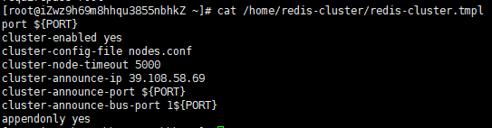
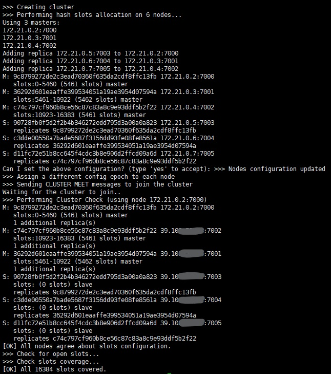

## 启动zookeeper      
```bash
3 常用命令
3.1. 启动ZK服务:        bin/zkServer.sh start
3.2. 查看ZK服务状态:  bin/zkServer.sh status
3.3  停止ZK服务:        bin/zkServer.sh stop
3.4. 重启ZK服务:        bin/zkServer.sh restart
3.5  连接服务器          zkCli.sh -server 127.0.0.1:2181
3.6  查看根目录 ls /
3.7  创建 testnode节点,关联字符串"zz"         create /zk/testnode "zz"
3.8  查看节点内容  get /zk/testnode
3.9  设置节点内容  set /zk/testnode abc
4.0  删除节点      delete /zk/testnode
```     
## docker fastdfs  
- 安装  [参考资料](https://blog.csdn.net/lizhihaooo/article/details/79261388)  
    ```bash
    # 拉取镜像
       docker pull morunchang/fastdfs
    # 查看镜像
       docker ps -a 
       docker image ls
    # 运行tracker
       docker run -d --name tracker --net=host morunchang/fastdfs sh tracker.sh
    # 运行storage
        ## 1.使用的网络模式是–net=host, <your tracker server address> 替换为你机器的Ip即可
        ## 2.<group name> 是组名，即storage的组
        ## 3.如果想要增加新的storage服务器，再次运行该命令，注意更换 新组名
       docker run -d --name storage --net=host -e TRACKER_IP=10.0.0.70:22122 -e GROUP_NAME=group1 morunchang/fastdfs sh storage.sh

  # 修改nginx的配置，不拦截上传内容
        ## 1.进入容器内部  
       docker exec -it storage /bin/bash
       cd data
        ## 2.修改nginx配置文件
       vi /data/nginx/conf/nginx.conf
     
        ## 3. 添加修改内容
          ### location /group1/M00 {
          ### proxy_next_upstream http_502 http_504 error timeout invalid_header;
          ### proxy_cache http-cache;
          ### proxy_cache_valid  200 304 12h;
          ### proxy_cache_key $uri$is_args$args;
          ### proxy_pass http://fdfs_group1;
          ### expires 30d;
          ###}
     
        ## 4.退出
        root@iZh3cshm0xz7wjZ:/data/nginx/conf# exit
        ## 5. 重启storage服务
        docker restart storage
    ```   
- 启动fastdfs     
```bash
docker start storage
docker start tracker 
```    
## docker redis 集群
- 安装  [参考资料](https://www.cnblogs.com/lianggp/articles/8136222.html) 
```bash
    docker pull redis   
    docker pull ruby   
    # 1、创建redis配置文件（redis-cluster.tmpl）
       ## 在路径/home/docker/redis-cluster下创建一个文件redis-cluster.tmpl  
        
        ###  port ${PORT}
        ###  protected-mode no
        ###  cluster-enabled yes
        ###  cluster-config-file nodes.conf
        ###  cluster-node-timeout 5000
        ###  cluster-announce-ip 39.10X.XX.XX //自己服务器IP
        ###  cluster-announce-port ${PORT}
        ###  cluster-announce-bus-port 1${PORT}
        ###  appendonly yes
     
    # 2、创建自定义network  
       docker network create redis-net
    # 3、创建容器
    ./redis-cluster/create-redis.sh 
    # 4、ruby启动集群
    ./redis-cluster/run-redis-cluster.sh
    
```    
 **redis-cluster.tmpl**配置文件详情：   
     
 启动redis集群成功消息：   


docker redis 自动运行

## solr 
- 安装    [参考资料1](https://c.163yun.com/hub#/m/repository/?repoId=3540)  [参考资料2](https://hub.docker.com/r/supermy/docker-solr/) 
    ```bash
    docker search solr
    docker pull hub.c.163.com/library/solr:latest
    docker run --name my_solr -d -p 8983:8983 -t hub.c.163.com/library/solr:latest 
    docker ps -a
    docker container ls
    ip add
    ## 访问 http://ip:8983/      
    ## 创建集合
    docker exec -it --user=solr my_solr bin/solr create_core -c gettingstarted
    
    ```   
- [中文分词](https://github.com/zxiaofan/ik-analyzer-solr6/releases)
    
- docker solr 在10.0.0.70服务器， 
```bash
 start my_chinese_solr
```   
[solr网页管理端](http://10.0.0.70:8983/solr/#/)  

- 备份使用
```bash
    docker pull rongmazhong/my_chinese_solr
    docker run --name my_chinese_solr -d -p 8983:8983 -t rongmazhong/my_chinese_solr 
```   
只有core1有中文分词。
可以修改managed-schema内容，权限改为8983：8983，再cp到容器中。
```bash
sudo chown 8983:8983 managed-schema
docker cp /home/docker/managed-schema  my_chinese_solr:/opt/solr/server/solr/gettingstarted/conf/managed-schema
docker stop my_chinese_solr
docker start my_chinese_solr
```     

