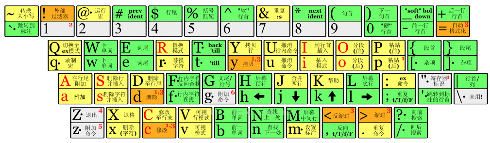

##  vim常用   

* <leader>键位： ，

| 命令       | 说明               | 命令               | 说明                 | 命令     | 说明               |
| ---------- | ------------------ | ------------------ | -------------------- | -------- | ------------------ |
| <space>e   | 调出切换器         | <space>f(ctrl+F12) | 查看当前类结构       | <space>a | 查找动作           |
| <space>j   | 打开最近文件       | <space>h           | JavaDoc              | <space>u | FindUsages         |
| <space>q   | 关闭当前页         | <space>r           | 启动                 | <space>d | debug启动          |
| <space>b   | 当前行打断点       | gc                 | 跳转到给定的类       | gb       | 回退               |
| sp         | 左右拆分窗口       | vsp                | 上下拆分窗口vsp      | gf       | 前进               |
| gl         | 跳到下个tab        | gh                 | 跳到上个tab          | gj       | 将光标移到下边窗口 |
| <leader>wh | 将光标移到左边窗口 | <leader>ww         | 将光标移到下一个窗口 | gk       | 将光标移到上边窗口 |

| Capslock+ | 功能                  | 命令  | 说明            | 命令      | 说明                 |
| --------- | --------------------- | ----- | --------------- | --------- | -------------------- |
| EDSF      | 上 / 下 / 左 / 右     | P；   | `Home` `End`    | WR        | `Backspace` `Delete` |
| IKJL      | 上 / 下 / 左 / 右选中 | HN    | 向左 / 右选中词 | Backspace | 删除光标行           |
| space     | Enter                 | Enter | 换行            | T         | 翻译                 |

